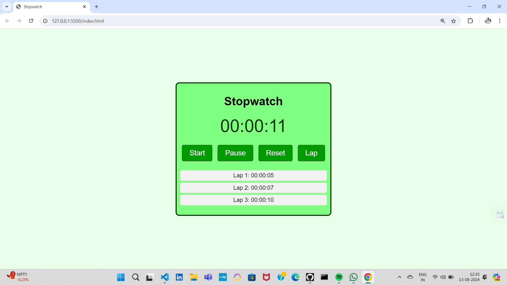

# Prodigy Infotech Internship - Task 02
## Stopwatch Project
In this project a simple and functional stopwatch built using HTML, CSS, and JavaScript. The stopwatch allows users to start, stop,reset and lap the timer, providing an easy-to-use interface with minimalistic design. It’s a great example of integrating JavaScript for time-based functions and dynamic updates in a web development context.

## Stopwatch

## Features
- **Start**: Initiates the stopwatch timer.
- **Stop**: Pauses the timer at the current time.
- **Reset**: Resets the timer to 00:00:00.
- **Lap**: Allows users to record intermediate times while the stopwatch is still running.

## Technologies Used
- **HTML**: Structure of the application.
- **CSS**: Styling for the stopwatch interface.
- **JavaScript**: Logic to handle the timer functionality.

**Name:** Rohit Sanap.
**Email:** rohitsanap177@gmail.com.
**LinkedIn:** www.linkedin.com/in/rohit-sanap-10989724a.